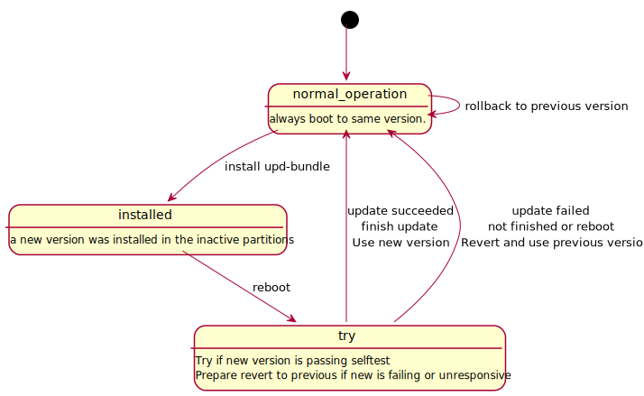
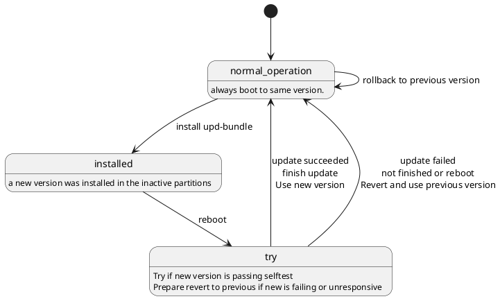

Rupdate - Update Concept using Rust
===================================


Rupdate is an update concept built around the idea of a pendulum update targeting an embedded linux system. This concept includes detailed specifications and Rust reference implementations for the following components:

<dl>
    <dt>Partition Description</dt>
    <dd>System wide accessible description of the partition layout, the partition sets used to allow pendulum updates and specification of different formats to provide this information to linux and userspace application as well as bootloaders, initramfs and hypervisors.</dd>
    <dt>Update Tool</dt>
    <dd>A linux userspace tool to install update bundles, handle system testing and rollbacks.</dd>
    <dt>Update Bundles (Packages)</dt>
    <dd>An archive format to manage partition images and update information.</dd>
    <dt>Update Environment</dt>
    <dd>An binary encoded data section accessible by the userspace update tool as well as a bootloader or hypervisor to share a common system state and synchronize updates.</dd>
</dl>

In the context of this detailed description of an update concept, the following tools  provided as part of this repository were implementations in Rust:

[Rupdate](./rupdate/) Tool install update bundles on the target (Embedded Linux System)


[partcfgimg](./partcfgimg/) Tool to generate partition configurations, used during deployment


[updenvimg](./updenvimg/)  Tool to generate update environment images, used during deployment

[update-tool-create-bundle](./scripts/bundle) Tool to generate update bundles, used on the build machine, as part of the SDK.

[bootloader](./bootloader/) Patches for bootloaders to implement the needed swinging functions

Although initially intended as a reference implementation, these tools are well tested and found to be pretty stable.

# Quick start


 1. Assuming the [bootloader support](./bootloader/) was added.
 2. Assuming the [partitions](./partcfgimg/) are created and configuration is in place.
 3. Assuming the bundles can be [created](./scripts/bundle) by SDK.

Then:

**1)** Build update bundle
``` bash
build-machine$ update-tool-create-bundle --allow-rollback -z --sha256 -c bootfs:fit.img rootfs:../root.img
```

**2)** Upload bundle to target
``` bash
build-machine$ scp bundle.tar.gz user@target:/tmp/
```

**3)** Install
``` bash
target$ rupdate update -b /tmp/bundle.tar.gz
```

**4)** Commit
``` bash
target$ rupdate commit
```

**5)** Reboot
``` bash
target$ reboot
```
Target reboots into new version. If reboot fails due to an inappropriate version, the older version will be restored.


**6)** Selftest to verify new version is really fine.

**7)** Finish to use version permanently
``` bash
target$ rupdate finish
```


# Update Swinging


The ```rupdate``` is switching between two partitions. One of them is actively used and the other is inactive. An update is installed to the inactive partitions and hence the update is powerfail safe and a return to the previous version is possible in case the new version is found unsuitable.

The flow of testing the new version is shown in following diagram.



<details>
  <summary>PlantUML Code</summary>


</details>

Further Details [here](details.md)

# Build


Use
```
./ci/build.sh
```
to build the tools and documentation.


## Dependencies

Rupdate is written in RUST, hence dependencies are found in [Cargo.lock](Cargo.lock).


## Documentation

To build this Documentation:
``` bash
plantuml -tsvg README.md -o doc/images/

```


# Future Development

- Port the update bundle generation to Rust
- Support signed update bundles (signature embedded after tar)
- Include partition flags in the partition environment
- Extend unit and integration tests
- Support usage of bootloader environment to store update state


# License

MIT License

Copyright (c) [2024] [emlix GmbH, Elektrobit Automotive GmbH]

The full text of the license can be found in the [LICENSE](LICENSE) file in the repository root directory.

Rupdate includes software developed by the OpenSSL Project for use in the OpenSSL Toolkit (http://www.openssl.org/)
Rupdate includes cryptographic software written by Eric Young (eay@cryptsoft.com)
Rupdate includes software written by Tim Hudson (tjh@cryptsoft.com)


### Powered by EB


Rupdate is powered by elektrobit automotive gmbh.
Elektrobit is an automotive software company and developer of embedded software products for ECU, AUTOSAR, automated driving, connected vehicles and UX.
Rupdate is an  integrated part of EB corbos Linux – built on Ubuntu is an open-source operating system for high-performance computing, leveraging the rich functionality of Linux while meeting security and industry regulations.


### Maintainers

* Andreas Schickedanz andreas.schickedanz@emlix.com [@Phidelux](https://github.com/Phidelux)
* Thomas Brinker thomas.brinker@emlix.com [@ThomasBrinker](https://github.com/ThomasBrinker)

### Credits

* Andreas Schickedanz
* Andreas Zdziarstek
* Fabian Godehardt
* Patrick Hoffmann
* Thomas Brinker

### Artwork

The rupdate logo is a uroboros of dromaeosauridae (raptor dinosaur), designed from the Rust Logo
and the usual spinning arrows often found for updates. Originator is Anja Lehwess-Litzmann
(emlix GmbH). Year 2024. It is licensed under Creative Commons No Derivatives
(CC-nd). It shall be used in black on white or HKS43 color.

