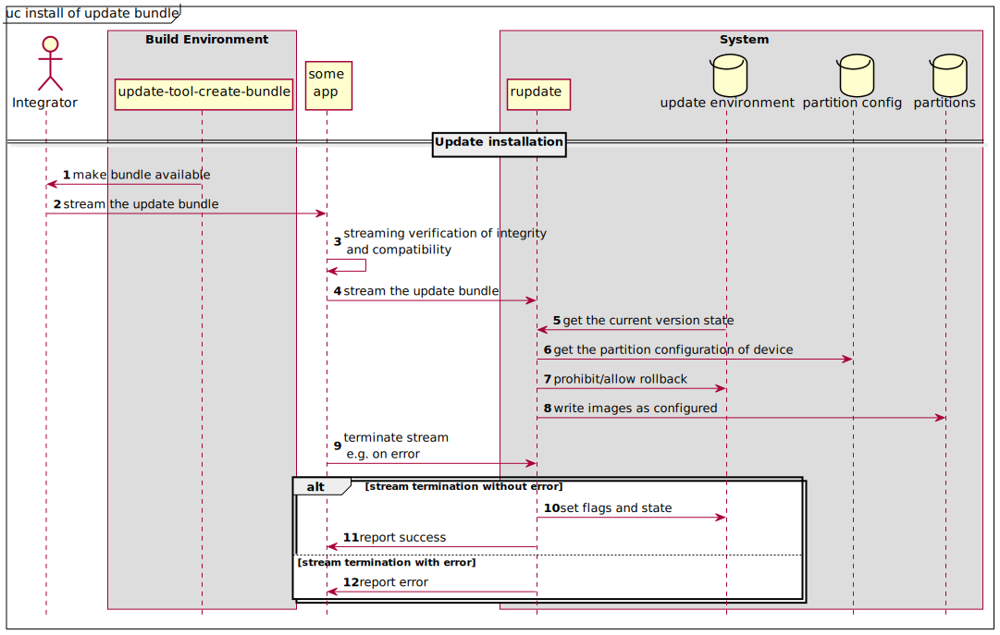

# Details of rupdate update flow
More details and especially the swing between A and be is shown in the following


<details>
  <summary>PlantUML Code</summary>


</details>

**Explanations:**

* *install*: A bundle is installed using Rupdate
* *finish*: An installed update was successfully selftested and shall now be used permanently
* *rollback*: A version already in full use shall be discarded and the former one shall be used (if permitted)

These functionalities are implemented in [Rupdate](rupdate/manual.txt)

* not finish / revert: A new version failed in selftest or did run out of tries, hence it need to be reverted, see [bootloader](./bootloader/)

# Install of an update

The installation of an update bundle is initiated by a higher level application, that hands the bundle over to ```rupdate``` for installation.
It is assumed that this app verifies the origin, integrity and compatibility of the update.

- **integrity**: verify that the bundle was not modified
- **origin**: verify that the bundle was created by authorized parties
- **compatibility**: verify that the bundle is intended to be installed on this device (e.g. correct hardware, etc.)

It is assumed that the  app decrypts the bundle in order to maintain **confidentiality**, if needed.




<details>
  <summary>PlantUML Code</summary>


</details>

The structure of update environment and partition config is documented here:

* [update environment](updenvimg/README.md)
* [partition config](partcfgimg/README.md)


### How to install an update

Call ``` rupdate update -b <bundle-file>``` to install an update-bundle.


# Bootup

During bootup bootloaders select which version of the OS to boot. Following diagrams shows such a flow:


<details>
  <summary>PlantUML Code</summary>


</details>

### How to boot

To correctly boot a system have these [patches](bootloader/) added to your bootloader.

Or implement feature as described in this [requirements](bootloader/requirements_to_bootloader.md).


## Update finish

After boot of a new version a self test shall be performed to ensure correct functionality.

The selftest needs to be committed by some app in user space. The definition of the selftest and especially its scope is left to the integrator. The integrator has to decide if a selftest after an update is pass or fail.

Examples:

- are all needed nodes still reachable on the network
- is a communication still possible or are any protocol mismatches detected

It is left to the integrator to implement any data migration after successful selftest.

Examples:

- convert end user (driver) configuration data to new data format
- convert and recalculate any calibration data specific to the exemplar.


<details>
  <summary>PlantUML Code</summary>


</details>

### How to finish an update

Call ``` rupdate finish``` to finish an update after successful selftest.


## Generation of update bundles

Update bundles contain a new version of the software, the structure of bundles is described in detail [here](scripts/bundle/README.md).


The generator for update bundles can be seen as part of the SDK and is executed in the same environment.

## Generation of images

The images containing the important information to allow Rupdate and bootloader to operate correctly are created as described:

```partcfgimg``` Tool to generate partition configurations, used during deployment, see [partcfgimg](./partcfgimg/) 

```updenvimg``` Tool to generate update environment images, used during deployment, see
[update-tool-create-bundle](./scripts/bundle)
