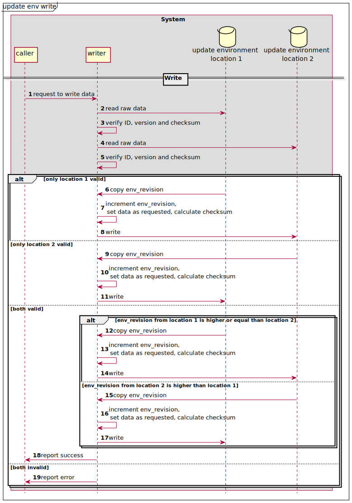
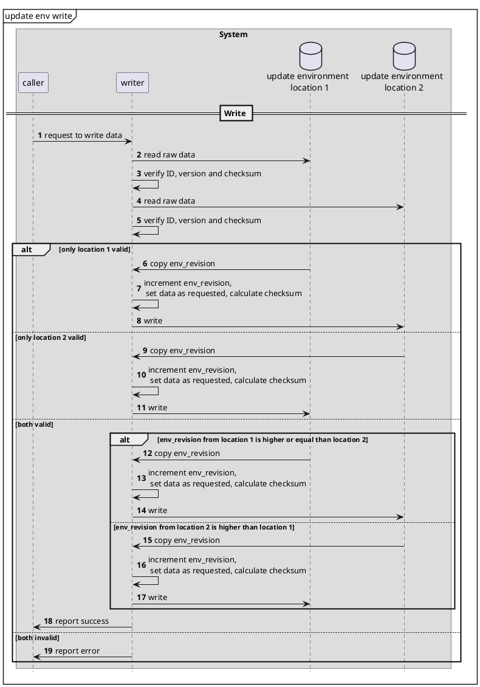
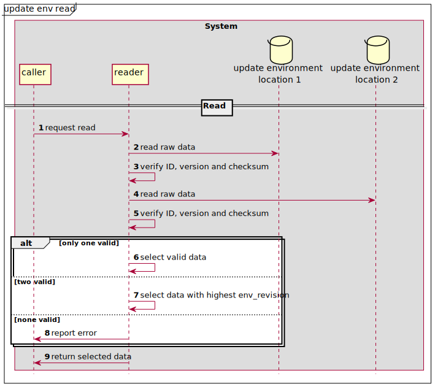
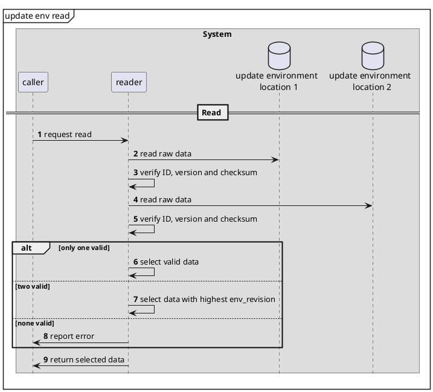

Generating the Update Environment with updenvimg
================================================

`updenvimg` is a tool written in Rust that generates an environment which is used to synchronize the state of an update between the update tool rupdate and bootloaders like [u-boot](https://docs.u-boot.org/en/latest/) or [barebox](https://www.barebox.org/), initramfs like [dracut](https://github.com/dracutdevs/dracut) or hypervisors like [L4re](https://www.st.com/en/partner-products-and-services/l4re-hypervisor.html). To make the adaption of these third party components as easy as possible, the environment is binary encoded following the [bincode](https://github.com/bincode-org/bincode) specification. The description of the updatable partitions is provided by a partition configuration (JSON), which is described in detail in the README of the [partcfgimg](../partcfgimg/README.md) tool.

## Update Environment (bincode)

The update environment is a binary encoded (bincode) description of the current update state, which major target is to make no or as little as possible assumptions on the bootloader or hypervisor. The main structure of this environment contains only two update states, which are separated with a fixed offset.

### Update State

The two update states are written in turns. This allows the system to recover from a failed write attempt, a system crash or a sudden power interrupt. To identify the latest update state, an environment revision is incremented with each write to the environment. Each of these states contains a four byte magic, a protocol version, an environment revision, a remaining boot try counter, a state identifier and a list of partition selections, followed by a hash sum:

| Field           | Description                                                   | Size    | Description          | Example       | Example Description                                                 |
|-----------------|---------------------------------------------------------------|---------|----------------------|---------------|--------------------------------------------------|
| magic           | ID of this data structure "update-environment"                | 4 Bytes | Magic Number         | "EBUS"        | Short for EB Update State                        |
| version         | version of update env syntax                                  | 4 Bytes | Version              | 0x0000_0001   | Version                                          |
| env_revision    | Identifies the most recent update state                       | 4 Bytes | Environment Revision | 34            | Number of updates done.                          |
| remaining_tries | Tries to boot active partitions.<br> **-1**: selected <br> **0**: no tries left <br> **&lt;n&gt;**: n tries left | 2 Bytes | Remaining Tries      | 16            | Remaining number of boot retries                 |
| state           | State of the update process: <br> **0: normal** 'normal' state - nothing to do<br> **1: installed** New update installed<br> **2: committed** New update committed<br> **testing=3** new version is tested. <br> **4: revert** Current version shall be reverted. | 1 Byte  | Update state         | 2             |                                                  |
| partsel_count   | List of partition selection for each partition set, see below | 8 Bytes | Partsel Count        | 42            | Number of partition selections                   |
|                 |                                                               |         | Partition Selection  | see below     | Description of partition selection               |
| checksum_type   | The type of the checksum e.g. 32=crc32 or 256=sha256          | 4 Bytes | Checksum Identifier  | 13            | A numeric identifier for the checksum type       |
| checksum        | The checksum of the before structure                          | n Bytes | Checksum / signature | &lt;SHA512&gt;| e.g. SHA512                                      |

### Partition Selection

As this update concept is created around a pendulum update, where two partitions A and B are combined into a partition set and updates are written in turns to those partitions. Which of these partitions is the one to be booted, is determined by the partition selection, which references a partition set in the partition configuration (linux) and partition environment (bootloader), the active variant (A or B), a rollback flag indicating if this partition set would be affected by a rollback and the affected flag indicating if the set is currently affected by an ongoing update:

| Field           | Description                                                       | Size     | Description         | Example       | Example Description                           |
|-----------------|-------------------------------------------------------------------|--------- |---------------------|---------------|-----------------------------------------------|
| name            | Name of the set                                                   | 36 Bytes | Set Name            | "rootfs"      | Name of the partition set.                    |
| active          | Active partition to be used (A or B)                              |  1 Byte  | Active              | "a"           | Active partition to be used (A or B)          |
| rollback        | **true**: Inactive set variant contains software to rollback to,<br>if part_desc.rollback=="permitted"<br>**false**, rollback not allowed or possible. |  1 Byte  | Rollback            | 0x00          | Rollback possible and allowed?                |
| affected        | Set affected by the update, partitions need to be swapped.        |  1 Byte  | Revert              | 0x01          | Needs A/B swap during revert.                 |

### Reference Implementation in C

```C
 #define UPDATE_ENV_MAGIC "EBUS"

enum hashsum_type {
    SHA256,
};

enum variant {
    A = 0,
    B = 1
};

enum state {
    NORMAL,
    INSTALLED,
    COMMITTED,
    TESTING,
    REVERT,
};

struct update_state {
    /* 4 byte magic identifier (ASCII encoded) */
    char magic[4];
    /* 4 byte version number */
    uint32_t version;
    /* 4 byte system revision */
    uint32_t revision;
    /* 2 byte remaining retries */
    int16_t remaining_retries;
    /* 1 byte state */
    uint8_t state;
    /* 8 byte number of partition selections */
    uint64_t partsel_count;
    /* array of <partsel_count> partition selections */
    struct partition_selection *partsel;
    /* 4 byte of hashsum identifier */
    uint32_t hashsum_type;
    /* n bytes of hashsum, size is determined by hashsum_type */
    uint8_t *hashsum;
}

struct partition_selection {
    /* 36 byte set name (ASCII encoded) */
    char[36] set_name;
    /* active partition in set;either A = 0x00 or B = 0x01 */
    uint8_t active;
    /* rollback allowed? either false = 0x00 or true = 0x01 */
    bool rollback;
    /* revert allowed? either false = 0x00 or true = 0x01 */
    bool affected;
};
```


# Duplicate storage of the environment


## Write the update environment

The update environment is stored in two independent locations, e.g. two different blocks. Integrity of update environments is verified by checksums. If checksums is verified successful for both the most recent one is used. The most recent update environment is identified by the env_revision. The higher the env_revision the more recent is the update environment.




<details>
  <summary>PlantUML Code</summary>


</details>

The update environment needs to be written before and after each write of an image to a partition.

### RAM-copy to write

Writing to the update environment shall be done as limited as possible by use of a local copy:
- copy the update environment to local memory in RAM
- accumulate all needed changes in that copy
- write the copy to update environment  storage in persistent memory


## Read the update environment


During read the only valid or the most recent update environment is returned.




<details>
  <summary>PlantUML Code</summary>


</details>


## building

Build the images with:
```
plantuml -tsvg README.md -o ../doc/images/

```
